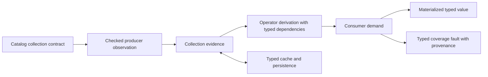

# Collection coverage: evidence, transfer and consumption

Status: architectural review and normative target, 2026-09-29. The implementation
inventory below is deliberately separate from the target contract. This document
does not certify implementation completion or replace test execution evidence.
It refines the `C` dimension of [Python conformance](python-conformance.md).

## The question coverage answers

For a declared collection expression Q at observation V, do the retained ordered
occurrences R represent all of Q? Coverage is relative to Q, not the entity type,
the HTTP response, a stored snapshot, or the amount of data visible to the agent.

A complete result for an incorrectly defined Q is still the wrong answer to the
user. Catalog semantic conformance establishes which collection Q denotes;
runtime evidence establishes whether its acquisition and transformations are
complete. Neither proof substitutes for the other.

Example: a domain's saved-song library may include tracks and album contents but
exclude playlist contents. All three inputs can be correctly typed Song rowsets
and completely acquired. A well-typed union of all three is nevertheless the
wrong domain collection. A catalog test must distinguish these memberships.

## Independent dimensions

| Dimension | Question | Must not be inferred from |
|---|---|---|
| Membership specification | Which occurrences belong to Q? | Type compatibility, endpoint names or generated teaching |
| Acquisition evidence | Has every required occurrence been obtained? | HTTP success, absence of a cursor, array length alone |
| Field availability | Which fields of each observed member are known? | Membership completeness or schema field inventory |
| Order and multiplicity | Is this a bag, sequence or identity-distinct result? | A cache keyed by identity |
| Delivery | Is this all retained data or a displayed/stored page? | Backend exhaustion |
| Freshness | Does evidence refer to the requested observation/version? | An old complete snapshot |
| Effects | What was dispatched, committed or left uncertain? | Collection completeness or service error text |

These dimensions can interact without collapsing into one enum. Failed hydration
can leave membership exhaustive and a requested field unavailable. A failed child
enumeration can leave the parent fields known and the flattened membership unknown.

## Evidence identity and ownership

Each proof is tied to a collection identity containing its catalog pin, owning
entry, producing capability/relation, receiver and selection/scope bindings,
expression derivation, and relevant freshness epoch or backend snapshot token.
Use typed identifiers and existing canonical fingerprints, not raw credentials in
logs. A plan node alone does not identify two different scoped occurrences.

A producer establishes evidence; transformations derive it; consumers request a
proof; cache and transport adapters preserve it. Consumers must never reconstruct
producer evidence from normalized values or from a schema declaration alone.

The catalog's exhaustive-array declaration is a premise, not a runtime proof:
it becomes evidence only when the declared raw path is present, well formed,
and every decoded occurrence is conserved. Empty, missing, null and malformed
are separate outcomes. The same rule applies recursively to nested arrays.

Trusted producer evidence includes:

- exhausted pagination under the declared pagination and consistency contract;
- exhaustive embedded membership with observed-path and occurrence checks;
- exact singleton/literal construction;
- a satisfied expression-prefix bound with valid upstream order and dependencies;
- derivation from proven dependencies under an operator's transfer rule.

A pagination driver must state its consistency assumptions. Exhaustion does not
invent transactional snapshot isolation when the backend lacks it. Evidence is
scoped to the observation contract actually supplied by that backend.

## Coverage states and reasons

Retain the public vocabulary Complete / Partial / Unknown:

- **Complete:** every occurrence of Q is represented.
- **Partial:** there is evidence that at least one occurrence of Q is omitted.
- **Unknown:** neither completeness nor omission is established for Q.

Carry typed reasons and provenance behind that projection. Examples are an
undeclared embedded-membership contract, missing raw path, truncated page,
unresolved continuation, unavailable child enumeration, stale observation,
missing dependency evidence, and conflicting exhaustive observations.

A generic `Partial dominates` fold is sufficient to prevent false Complete, but
is not an exact transfer rule. For example, a filter may reject every unseen
source row; distinct may collapse every unseen duplicate. Known omission in an
input is not automatically known omission in its transformed output. Without a
surviving omission witness, report Unknown and retain the input reason. Never
weaken safety by promoting either state to Complete.

A missing declared dependency is an invalid execution state, not a normal
Unknown observation. Undeclared source completeness can legitimately be Unknown.
Keep those cases distinguishable in typed errors.

## Operator laws

The following are conservative rules. Extra promotions require named, tested
proof rules; row counts or successful execution alone cannot supply them.

| Operator | Completeness obligation and transfer |
|---|---|
| Constant, known singleton | Exact construction establishes Complete for that expression |
| Query/page acquisition | Exhaustion plus retained occurrences; discarded rows prevent Complete |
| Projection/rename | Preserve membership evidence when occurrences are conserved; field demands checked separately |
| Row-local map | Preserve coverage when total and occurrence-preserving; computation failure is an error |
| Filter | Complete source and all collection captures permit Complete output; incomplete source is conservatively Unknown unless omission is witnessed in output |
| Union/concatenation | Every contributing input required; preserve declared bag/order semantics; identity-distinct union additionally needs deduplication transfer |
| Distinct | Complete input permits Complete output; unseen inputs may be duplicates, so input Partial alone does not prove output Partial |
| Sort | Global order requires complete input unless a specific backend prefix proof suffices |
| Take(0) | Exact empty expression, Complete |
| Take(n) | Complete when source is complete, or a valid expression-prefix proof establishes n ordered results; host caps and post-hoc counts do not prove this |
| Flat-map/relation traversal | Complete parent enumeration and exhaustive child membership for every parent occurrence; conserve duplicates and order according to the expression |
| Empty flat-map | Complete empty parent enumeration proves complete empty output; an arbitrary empty proof fold does not |
| Aggregate/group | Whole-input demand; a single output row is not evidence that its input was complete |
| Membership/anti-membership | Whole RHS for ordinary exact evaluation; source/captures remain explicit dependencies |
| Compute/render/record or array embedding | Every whole-collection input must be complete and fully materialized; field presence checked independently |
| Iteration | Carry seed, capture and retained-step evidence; stop-predicate success does not repair an uncertain collection |
| Write fanout | Establish selection and exclusion proofs before affected business writes; acquisition failures retain their typed cause and separate effect receipts |

A finite ordinary Python list built from fully observed inputs is complete for
that list expression, not proof of exhaustive membership in an external relation.
An explicitly requested prefix is a different Q from an accidentally capped full
query. This distinction must survive lowering.

Existential witnesses can theoretically prove `any=True`, and counterexamples can
prove `all=False`, without exhaustion. The current quantifier contract requires
complete inputs. This specification does not silently enable witness-based
short-circuit semantics; that needs an explicit later rule and execution tests.

## One deep module

Introduce a collection-evidence module within the existing crates, with a small
interface shared by producer adapters, DAG execution and consumers. No new crate
or dependency is required. The following is design notation, not existing Rust:

```rust
observe(contract, observation) -> Result<CollectionEvidence, CoverageFault>
derive(operator, scoped_inputs, conservation) -> Result<CollectionEvidence, CoverageFault>
require(demand, evidence, materialization) -> Result<SatisfiedDemand, CoverageFault>
```

`CollectionEvidence` owns the collection identity, observation identity and typed
proof/reasons. Constructors are constrained to checked producer observations and
named derivations. `scoped_inputs` contains typed plan ports/occurrence identities,
not rediscovered string labels. `conservation` includes ordered identity occurrences
and explicit omissions; counts alone cannot detect substitution or reordering.
`SatisfiedDemand` is tied to the same immutable collection/materialization, not a
boolean that can be reused after mutation.

Membership evidence belongs with semantic rows in core. Runtime owns acquisition,
continuations and freshness observations. Agent-core supplies typed DAG operators
and demands; it does not implement a second evidence algebra. Adapter-specific
HTTP termination rules remain adapter-owned inputs to the shared interface.
Avoid a process-global unbounded proof log: retain compact typed cause/dependency
references and use the existing trace system for detailed diagnostic evidence.

Continuation is a resolution mechanism, not a second truth flag. Acquisition
continuation and presentation continuation must be distinguishable. A consumer
may first materialize all already-acquired rows and then satisfy its demand;
it must not reject a complete logical result merely because the UI paged it.
The module checks that no retained rows are hidden from the actual consumer.



## Failure and recovery contract

A coverage failure identifies the consumer, source collection/occurrence, unmet
demand, producer reason and available acquisition route. It must not become
`unclassified_execution_failure` or tell an agent to rewrite valid Python.
Service messages remain opaque. Coverage faults and operation receipts are
independent fields in an execution outcome.

Known completed prerequisite acquisition, known completed business effects and
unresolved write outcomes are separate recovery facts. A pre-business-write
coverage failure after login must not be treated as an uncertain business write.
Reconciliation must admit contract-authorized observations with prerequisites,
while preventing replay of unresolved business effects. This is not permission
to declare every login harmless or infer idempotence from its name/HTTP status.
The existing effect contract must supply that classification; absence of such a
contract remains an explicit design obligation, not a hardcoded auth exception.

## Recording codec implementation

`plasm-core::collection_codec::CollectionCodec` is an object-safe interface with
one `RecordingCodec<R>` implementation. `RecordedCollection<R>` has private state
and no public deserializer. `acquire`, `record`, `derive`, `materialize`, `encode` and `decode`
are the construction, transformation, demand and persistence seams. Frames are
versioned and integrity-checked for trusted storage, not authenticated external
proofs. Row JSON encoding occurs only at that serialization seam.

The implemented derivations are identity, occurrence permutation, filter, stable
full-row distinct, materialized take, ordered concatenation, occurrence-scoped
flat-map, occurrence-preserving map, one-observation replacement and general typed
evaluation. Map checks output cardinality; uncertain collection captures make its
coverage Unknown. General evaluation cannot infer Complete from the size of its
output: incomplete inputs remain Unknown with their producer gaps. They
construct retained outputs directly from validated occurrence records. Filter
predicates execute in the operator; the codec validates retained source positions
without interpreting Python or implementing another predicate evaluator. Gaps retain producer identity through
transformations. Derived identities bind the ordered input catalog, expression
and observation identities. Explicit dependencies may come from different catalogs
or observation epochs; they cannot be substituted when checking a declared capture
or child, or when restoring a stored collection. Producer adapters remain responsible for establishing
raw-path and driver facts before submitting observations.

### Ordered acquisition and query-index storage

`CollectionCodec::acquire` records one scoped page sequence. Every append checks
identity, ordinal, retained versus decoded cardinality, and that acquisition has
not terminated. Invalid appends are atomic. Final driver exhaustion seals preceding
pages, but never erases discarded occurrences. Zero pages remain Unknown; an
observed exhausted empty page is Complete. Immutable page batches are shared into
the final record without copying payloads. Producer adapters still validate raw
occurrence correspondence before appending.

The production non-paginated query index now records its exhausted membership
through this interface. Keys bind the catalog, complete query expression, selected
capability, resolved environment and graph observation epoch. The index accepts
only a matching Whole record. Fork snapshots share recorded reference batches.
Complete empty results, order and duplicates survive reuse. Differing observations
at one identity become a disputed cache entry; branch merge cannot manufacture a
sorted union or resurrect disputed membership. Superseded epochs for the same
expression are released. Query-index merge properties check
associativity, commutativity and idempotence against independent sequence equality.

Relation membership clones share their immutable recorded reference batch;
storage restores a validated checkpoint. Scoped codec evidence replaces the
unattributed exhaustive boolean. Hydration failures retain explicit
unavailable fields without downgrading independently exhausted query membership.
Predicate and top-k consumers reject an explicitly unavailable field with the typed
`FieldUnavailable` failure (`field_unavailable`, ResponseContract, Stop), rather
than evaluating it as null. Boolean branches that do not consume the field remain
lazy. This field-demand witness is `execution::predicates::field_demand_tests`.

Paginated result assembly, `ExecutionResult`, spill and typed DAG consumers now
carry the acquired record end to end. The validation status and storage version
boundary are recorded below.

### Reference ownership

`RecordedCollection<R>` stores immutable `SharedRows<R>`. The row sequence uses
shared immutable payload batches and ordered occurrence coordinates. Neither the
codec trait nor its implementation requires `R: Clone`. Identity, selection,
permutation, distinct, take, concatenation and flat-map retain references to those
batches; duplicate occurrences remain distinct positions, even when they point to
the same payload. Cloning a record shares both the payload and coordinate storage.
`materialize` returns a borrowed view tied to the recorded collection's lifetime.
There is no mutable row view that can invalidate the evidence.

A new observation or computed value supplies a new payload. Replacing an observed
row shares all unchanged rows and preserves the original record. Serialization is
an explicit boundary: restored payloads are allocated from the stored frame and
validated against the requested identity. In-memory derivation does not serialize
and reconstruct rows.

A selection can retain its source batch while any selected occurrence still uses
it; this is batch-level sharing, not per-row reclamation. Empty selections release
all payload batches, and selections from concatenations release unused batches.
Concatenation deduplicates backing allocations without deduplicating occurrences.
Graph/spill integration must keep ordered membership separately
from payload residency; an empty hot payload buffer is not an empty collection.

Non-Clone payload tests and generated pointer-identity checks cover sharing,
duplicate occurrences, source-drop safety and exactly-once destruction. These
checks establish kernel ownership; they do not certify that the existing runtime
adapters have completed their migration.

Permutation validates each source position exactly once, including positions
whose values compare equal. It preserves input uncertainty and producer gaps;
sorting observed rows does not establish complete global order. Ordering keys
are evaluated by the operator, not by the codec.

The production cached-relation materializer uses the shared occurrence-prefix
validator against typed references. A materialization cap may remove a suffix;
substitution, reordering, excess rows and loss of an interior duplicate are
contract faults even when counts match. Conservation does not establish
exhaustive membership: undeclared membership remains uncertain. Collection
faults enter execution recovery as typed response-contract failures, without
inventing mutation effects from diagnostic text.

`collection_codec::tests` supplies an independent finite sequence oracle and
512 generated cases per property, with shrinking. Properties cover composed
pipelines with hidden occurrences, exact results, conservation, duplicates/order,
repeated storage round trips, demand equivalence, frame corruption and identity
mismatch. Explicit witnesses cover empty-parent distinctions, child substitution,
producer attribution and typed reference disk storage. This is finite evidence,
not proof of the complete CE-01–CE-07 product.

## Production carrier cutover

`ExecutionResult.collection` carries an `ExecutionCollection`: immutable
`RecordedCollection<Ref>` membership plus shared resident payloads. Count and
coverage are projections of that record, never independently assignable fields.
`ExecutionEvent::Page` transports resident batches; exactly one terminal
`Complete(ExecutionResult)` supplies the acquisition proof. Missing, duplicated,
or late terminal records fail the stream contract.

`SharedRows` holds immutable batch owners and occurrence coordinates. Selection,
concatenation, delivery windows, graph resolution and capture share payloads.
A cache observation or field transformation may allocate a new row. A view must
not clone every payload merely to retain order or duplicate an occurrence.

A delivery window preserves full logical membership and is not a complete physical
materialization. `Demand::Whole` checks logical evidence; physical consumers also
require residency. `NotResident` and `Conservation` are distinct failures.
Graph resolution looks up recorded identities, rejects missing identities, and
replays original order and duplicates. Cache iteration order and telemetry do not
supply membership.
An immutable, unprojected observation can supply its recorded parent identity
after cache invalidation; this permits a subsequent explicit fresh read. A
projected row instead resolves its canonical graph identity and cannot substitute
its reduced payload for a missing graph row.

An explicit `page(pN)` expression is different from an implicit delivery window:
it derives a new rowset by selecting recorded occurrence positions. Its count is
the selected membership, and its resident payloads share the stored collection's
owners. Selection preserves the source's uncertainty; a small page cannot mint
completeness. The continuation retains the original collection and its proof.

`RelationMembership` stores a codec record, not an exhaustive boolean. Decoders
record catalog-scoped raw observations. Normalized public values enter as unproven
observations; they cannot reconstruct exhaustiveness from schema declarations.
Cache updates replace relation observations atomically rather than unioning
unrelated uncertain observations. Branch conflicts compare entire observations.

DAG synthetic outputs bind typed dependencies. Cardinality-preserving compute
operators derive maps, limits derive explicit takes, relation fanout derives one
child per parent occurrence, and iteration retains its stop-predicate dependencies.
A missing declared dependency is an error. No paging flag contributes evidence.
Scoped captures select one value-shape marker with the captured occurrence;
filter and flatten outputs carry the corresponding markers in output order.
Values, identity handles and shape markers must conserve the same cardinality.
An empty shape vector is only the compact representation of all-record rows.

Graph page storage uses schema 4; run snapshots use schema 3. Snapshots retain
shared typed rows and a recording-codec checkpoint. Decode validates the checkpoint
and exact ordered row identities. Agent presentation is a terminal JSON projection.
Old proofless snapshots are rejected; there is no default-to-Unknown restoration
path. Checkpoints detect corruption and identity mismatch in trusted storage;
they are not signatures authenticating untrusted producers.

The carrier cutover was validated on 2026-09-30 through the production paths and
abstract fixtures below. The same run exercised the codec's independent sequence
oracle, ownership/lifetime properties, host concurrency, typed snapshot storage,
post-write reads, paging and graph spill. No legacy carrier or proofless restore
path is retained.

| Gate | Passed | Explicitly ignored |
|---|---:|---:|
| `plasm-core` library | 1,042 | 0 |
| `plasm-compile` library | 77 | 0 |
| `plasm-runtime` library | 385 | 0 |
| `plasm-agent-core` library | 1,174 | 7 |
| Python language matrix | 116 | 1 |
| View matrix | 16 | 0 |
| Graph-spill integration | 1 | 0 |
| **Total** | **2,811** | **8** |

All executed tests passed. The Hermit integration target also compiled, and
workspace formatting and diff checks passed. The ignored tests retain their
explicit opt-in requirements; this validation did not run an AppWorld evaluation.

From the workspace root, with `PLASM_MONTY_BINARY` pointing to the pinned worker:

```sh
RUST_MIN_STACK=16777216 cargo test -j 2 --no-fail-fast \
  -p plasm-core -p plasm-compile -p plasm-runtime -p plasm-agent-core -p plasm-e2e \
  --lib --test plasm_language_matrix --test plasm_language_matrix_views \
  --test graph_spill_e2e -- --test-threads=4
```

## Literate conformance plan

Implement these law families through the production module interface. Integrate
with the existing SC-07/BC boundary ledger and collection-boundary matrix rather
than introducing a second executable coverage ledger. The IDs below are design
obligations until registered with actual executable witnesses; none is a passed
`plasm-law` block merely because it appears here.

| Obligation | Existing evidence to reuse | Required extension |
|---|---|---|
| CE-01 Producer proof | runtime coverage unit tests; pagination matrix | Every stop kind × zero/exact/over-cap; inconsistent driver proof rejected |
| CE-02 Embedded proof | relation_coverage membership preservation tests | Missing/null/malformed/empty/duplicates; parent and nested scopes; omitted declaration remains Unknown with reason |
| CE-03 Transfer | codec and typed fanout/membership/iteration tests | Independent finite occurrence oracle for every operator; no false Complete and correct omission semantics |
| CE-04 Conservation | hydration/capture/cache/persistence tests | Same-count substituted refs, reordered refs, duplicate occurrences, conflicting epochs, cold spill and restore |
| CE-05 Consumption | collection_boundaries.rs; quantified-predicate matrix | Whole collections in every recursive consumer/capture position; delivery page versus acquisition page |
| CE-06 Recovery | write-contract and observation-honesty tests | Coverage failure before any business dispatch, completed prerequisite, partial committed business writes, uncertain dispatch; reads requiring prerequisites |
| CE-07 Domain meaning | catalog integration tests (separate from language fixtures) | Distinct in-scope and out-of-scope members; native endpoint/model evidence, not mocks generated from the same incorrect catalog |

Use a finite independent model over occurrence IDs, order, missing members,
field-presence maps and observation epochs. Generate composed pipelines and
compare production results/proofs to this oracle; shrink failing pipelines.
Test no-op semantic round trips through capture, cache, spill and serialization.
Cross products are defined by operator demands, not a growing list of failed
AppWorld programs. Keep unimplemented products explicitly open in the existing
conformance inventory. Run abstract language laws with abstract fixtures; real
catalog meaning belongs in catalog integration evidence.

## Cutover sequence and acceptance

1. Register law families and counterexamples in the existing literate matrix;
   preserve current failures as red witnesses, including failure classification.
2. Introduce checked producer evidence and demand checks, replacing independent
   construction/check sites. Migrate all affected public/internal representations
   together; no boolean/enum proof fallback remains authoritative.
3. Replace label-based dependency discovery and generic folds with typed operator
   derivations. Cover all registered constructors and scoped captures.
4. Carry proof identity through storage; version incompatible formats explicitly.
5. Integrate typed faults with effect recovery and compact agent corrections.
6. Repair/prove catalog collection meanings and exhaustive producers separately;
   replay diagnostic programs, then smoke before another dev evaluation.

Acceptance requires the registered law inventory, independent model tests,
production seam round trips, live matrix witnesses and catalog conformance all
passing for their declared scope. A successful eval or a green subset is not a
substitute. Do not weaken completeness or label every array complete to obtain a
higher task pass rate.
